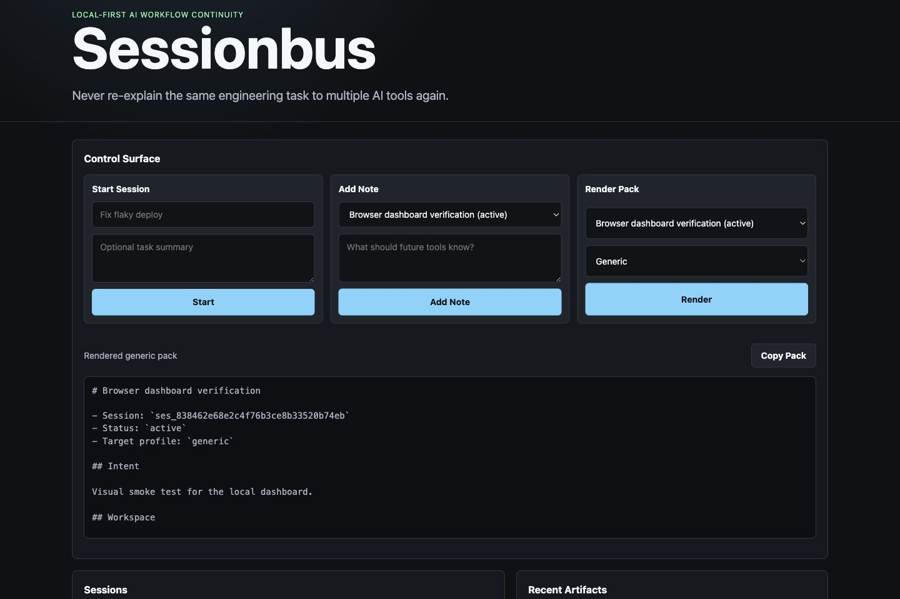

# Sessionbus

Local-first continuity infrastructure for AI-assisted engineering work.

Sessionbus gives every engineering task a durable local home so you can move
between Codex, Cursor, ChatGPT, Claude, terminals, IDEs, MCP tools, and internal
systems without re-explaining the same task from scratch.

> Never re-explain the same engineering task to multiple AI tools again.



## Why

AI coding tools are powerful, but the workflow around them is fragmented.
Engineers repeatedly lose:

- task intent and current status
- decisions and rationale
- terminal output and test failures
- git/workspace context
- handoff state between tools

Sessionbus synchronizes **engineering intent and task state**, not AI
conversations. The engineering task is durable; AI tools are transient.

## What It Is

- A local Rust daemon with SQLite persistence.
- A CLI-first workflow through `aictx`.
- A deterministic context packer for ChatGPT, Claude, Cursor, ACP, and generic
  handoffs.
- A stdio MCP server for AI tools.
- A dashboard at `http://127.0.0.1:8765/dashboard`.
- A sidecar adapter model for future integrations.

It is not an agent framework, chat UI, model wrapper, cloud SaaS, or
orchestration platform.

## Quick Start

```bash
cargo build --workspace
target/debug/aictx setup
```

Or install the CLI locally:

```bash
PREFIX="$HOME/.local" ./scripts/install.sh
export PATH="$HOME/.local/bin:$PATH"
aictx setup
```

For an opt-in local install that writes Codex MCP config and shell helpers:

```bash
target/debug/aictx setup --write --auto-capture --open-dashboard
```

Then start using a durable task:

```bash
target/debug/aictx doctor
target/debug/aictx start --repo "Fix flaky deploy"
target/debug/aictx note "Issue only happens in staging"
target/debug/aictx capture -- cargo test
target/debug/aictx add-diff
target/debug/aictx pack --for cursor
target/debug/aictx dashboard --print-url
```

Open the printed dashboard URL to view sessions, recent artifacts, recent
events, add notes, close sessions, and render/copy context packs.

## MCP Setup

For Codex, add this to `~/.codex/config.toml`:

```toml
[mcp_servers.sessionbus]
command = "/absolute/path/to/sessionbus/target/debug/aictx"
args = ["mcp", "--ensure-daemon"]
startup_timeout_sec = 10
```

Or print the snippet from the CLI:

```bash
target/debug/aictx install codex
target/debug/aictx install codex --write
```

The MCP server exposes tools for current session lookup, pack rendering,
artifacts, events, workspace facts, notes, decisions, and coordination messages.

## Daily Workflow

```bash
eval "$(target/debug/aictx shell-init zsh)"
target/debug/aictx start --repo "Build new billing export"
aictx-capture cargo test -p billing
target/debug/aictx message add "Please inspect the failing export test" --to codex --topic billing --requires-response
target/debug/aictx pack --preview --for chatgpt
```

For passive command-line continuity, opt into shell command observation. This
records command lines, exit codes, shell name, and duration into the active
session; it does not capture terminal output unless you use `aictx capture`.

```bash
eval "$(target/debug/aictx shell-init zsh --auto-capture)"
target/debug/aictx install shell --write --shell zsh --auto-capture
```

The TypeScript terminal adapter exposes the same behavior as a sidecar process:

```bash
bun adapters/terminal/src/index.ts register
bun adapters/terminal/src/index.ts observe --session "$(aictx current)" --shell zsh --exit-code 0 -- cargo test
aictx doctor
```

`aictx doctor` and the dashboard both show registered integrations, declared
capabilities, and recent adapter activity.

Shell completions:

```bash
aictx completions zsh > ~/.zfunc/_aictx
aictx completions bash > ~/.local/share/bash-completion/completions/aictx
aictx completions fish > ~/.config/fish/completions/aictx.fish
```

Useful commands:

```bash
aictx current
aictx observe-command --shell zsh --exit-code 0 -- cargo test
aictx session doctor
aictx session suggest
aictx session bind --repo
aictx sessions --active
aictx message list
aictx message ack art_...
aictx message resolve art_...
```

## Privacy

Sessionbus is local-first by default:

- daemon binds to loopback
- data lives in the current user's local data directory
- no cloud sync in v0
- file bodies are captured only when explicitly added
- redaction runs before packs are printed

Repo-local policy:

```bash
aictx policy init
```

Then edit `.sessionbus/policy.toml`:

```toml
redact_keys = ["CLIENT_ID", "INTERNAL_TOKEN"]
```

Check redaction:

```bash
aictx redact test "CLIENT_ID=company-internal"
```

## Dashboard

Run:

```bash
aictx mcp --ensure-daemon
aictx dashboard --print-url
```

The dashboard is served by the daemon and provides a browser control surface for
sessions, notes, events, and pack rendering. It is intentionally local-only.

## Development

Sessionbus uses Rust for the daemon/CLI/core and Bun for TypeScript adapters and
the E2E harness.

```bash
bun install
bun run selftest
```

`bun run selftest` builds the TypeScript workspace, runs Rust format/tests/build,
starts a real daemon, drives the CLI, exercises MCP, checks redaction, and hits
the dashboard.

Current workspace:

- `crates/sessionbus-core`: domain types, schemas, packer, redaction.
- `crates/sessionbus-store`: SQLite event log and projections.
- `crates/sessionbus-daemon`: local HTTP API and dashboard.
- `crates/aictx-cli`: CLI and MCP entrypoint.
- `crates/sessionbus-acp-bridge`: ACP bridge skeleton.
- `packages/adapter-sdk-ts`: TypeScript adapter SDK.
- `adapters/*`: example adapters.
- `scripts/install.sh`: local source install helper.

## Status

This is an early OSS MVP. The core loop is working and E2E-tested, but APIs may
change while the adapter ecosystem and dashboard mature.
