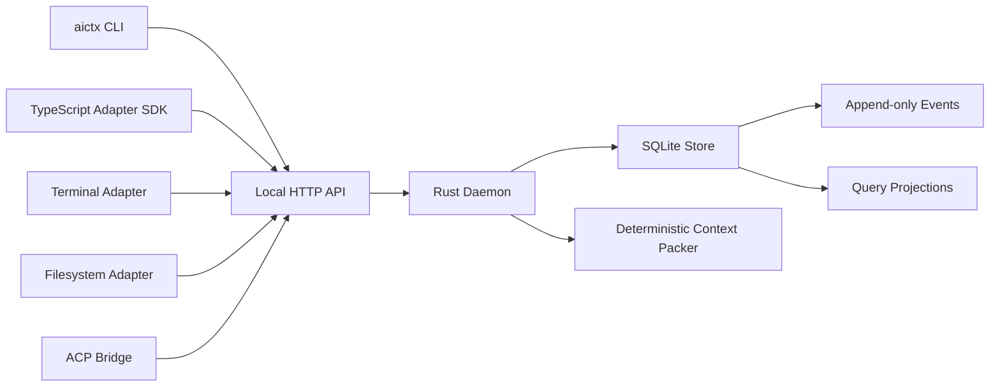

# Architecture

Sessionbus is a local-first interoperability layer for engineering task
continuity across fragmented AI tools.

It synchronizes engineering intent and task state. It does not synchronize AI
conversations, run agents, choose models, or orchestrate tools.

## Runtime shape

The daemon owns local state and exposes a small HTTP API. Sidecar adapters run
out of process and register capability descriptors. The daemon is deliberately
not a plugin host.

Request handlers emit `tracing` spans. Those spans are the hook point for
OpenTelemetry exporters once the daemon grows beyond the local MVP.

## Boundaries

- The core crate defines portable contracts: sessions, artifacts, decisions,
  events, capabilities, and context packs.
- The store crate persists an event log plus projection tables in SQLite.
- The daemon crate exposes local HTTP resources and NDJSON event export.
- The CLI crate talks to the daemon and tracks the active local session.
- The ACP bridge is a sidecar adapter. It maps ACP-observable metadata into
  Sessionbus artifacts and packs. It does not make Sessionbus an ACP agent.

## Degradation model

Adapters declare what they can do. A rich adapter can observe sessions, stream
updates, and import context. A minimal adapter can still export or import a
Markdown/JSON pack. This keeps the MVP useful without vendor cooperation.
